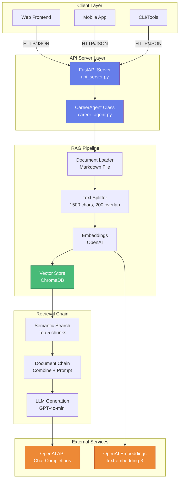

# Career Agent Architecture

## System Architecture Overview (Mermaid Diagram)



## System Architecture Overview (ASCII)

```
┌─────────────────────────────────────────────────────────────────────┐
│                          CLIENT LAYER                                │
├─────────────────────────────────────────────────────────────────────┤
│                                                                     │
│  ┌──────────────┐  ┌──────────────┐  ┌──────────────┐             │
│  │   Web App    │  │ Mobile App   │  │  CLI/Tools   │             │
│  │  (Frontend)  │  │  (React/Flutter) │  (Python/curl) │         │
│  └──────┬───────┘  └──────┬───────┘  └──────┬───────┘             │
│         │                  │                  │                      │
│         └──────────────────┼──────────────────┘                      │
│                            │                                         │
│                    ┌───────▼────────┐                                │
│                    │  HTTP/REST API │                                │
│                    │  (JSON Requests)│                               │
│                    └───────┬────────┘                                │
└────────────────────────────┼─────────────────────────────────────────┘
                              │
┌─────────────────────────────▼─────────────────────────────────────────┐
│                      API SERVER LAYER                                │
├─────────────────────────────────────────────────────────────────────┤
│                                                                     │
│  ┌──────────────────────────────────────────────────────────────┐  │
│  │                    FastAPI Server                            │  │
│  │  (api_server.py)                                            │  │
│  │                                                              │  │
│  │  Endpoints:                                                  │  │
│  │  • POST /api/v1/cover-letter                                │  │
│  │  • POST /api/v1/blurb                                       │  │
│  │  • POST /api/v1/role-summary                                │  │
│  │  • POST /api/v1/star-story                                  │  │
│  │  • POST /api/v1/interview-answer                            │  │
│  │  • POST /api/v1/query                                       │  │
│  │  • GET  /health                                             │  │
│  │  • GET  /docs (Swagger UI)                                  │  │
│  └──────────────┬───────────────────────────────────────────────┘  │
│                 │                                                   │
│                 │ Instantiate                                       │
│                 ▼                                                   │
│  ┌──────────────────────────────────────────────────────────────┐  │
│  │                  CareerAgent Class                            │  │
│  │                (career_agent.py)                             │  │
│  └───────────────────────┬──────────────────────────────────────┘  │
└───────────────────────────┼─────────────────────────────────────────┘
                            │
┌───────────────────────────▼─────────────────────────────────────────┐
│                    RAG PIPELINE LAYER                                │
├─────────────────────────────────────────────────────────────────────┤
│                                                                     │
│  ┌──────────────────────────────────────────────────────────────┐  │
│  │                  Document Processing                         │  │
│  │                                                              │  │
│  │  1. Load Markdown File                                      │  │
│  │     (ram_career_context.md)                                  │  │
│  │                                                              │  │
│  │  2. Text Splitter                                           │  │
│  │     • Chunk size: 1500 chars                                │  │
│  │     • Overlap: 200 chars                                    │  │
│  │     • Smart separators (##, ---, etc.)                     │  │
│  │                                                              │  │
│  │  3. Create Embeddings                                       │  │
│  │     • OpenAI Embeddings API                                 │  │
│  │     • Model: text-embedding-3-small                         │  │
│  │                                                              │  │
│  │  4. Vector Store                                            │  │
│  │     • ChromaDB (local)                                      │  │
│  │     • Persisted to disk (./chroma_db/)                     │  │
│  │     • Fast semantic search                                  │  │
│  └───────────────────────┬──────────────────────────────────────┘  │
│                          │                                           │
│                          │ Query                                     │
│                          ▼                                           │
│  ┌──────────────────────────────────────────────────────────────┐  │
│  │                  Retrieval Chain                             │  │
│  │                                                              │  │
│  │  1. Query → Retriever                                       │  │
│  │     • Semantic search in vector store                       │  │
│  │     • Returns top 5 relevant chunks                          │  │
│  │                                                              │  │
│  │  2. Document Chain                                           │  │
│  │     • Combines retrieved chunks                            │  │
│  │     • Formats with prompt template                          │  │
│  │                                                              │  │
│  │  3. LLM Generation                                           │  │
│  │     • OpenAI GPT-4o-mini                                     │  │
│  │     • Context + Prompt → Generated Content                  │  │
│  └───────────────────────┬──────────────────────────────────────┘  │
└───────────────────────────┼─────────────────────────────────────────┘
                            │
┌───────────────────────────▼─────────────────────────────────────────┐
│                     EXTERNAL SERVICES                                │
├─────────────────────────────────────────────────────────────────────┤
│                                                                     │
│  ┌──────────────────────┐      ┌──────────────────────┐          │
│  │   OpenAI API         │      │   OpenAI Embeddings   │          │
│  │   (GPT-4o-mini)      │      │   (text-embedding-3)  │          │
│  │                      │      │                      │          │
│  │  • Chat Completions  │      │  • Vector embeddings  │          │
│  │  • Text Generation   │      │  • Semantic search     │          │
│  └──────────────────────┘      └──────────────────────┘          │
└─────────────────────────────────────────────────────────────────────┘
```

## Data Flow Diagram

```
User Request (Cover Letter/Blurb/etc.)
         │
         ▼
┌────────────────────┐
│  FastAPI Endpoint  │  ← Validates request, formats parameters
└─────────┬──────────┘
          │
          ▼
┌────────────────────┐
│  CareerAgent       │  ← Routes to appropriate method
│  Method            │     (generate_cover_letter, etc.)
└─────────┬──────────┘
          │
          ▼
┌────────────────────┐
│  Build Query       │  ← Constructs prompt with:
│                    │     • User requirements
│                    │     • Tone, length, style
│                    │     • Company/role context
└─────────┬──────────┘
          │
          ▼
┌────────────────────┐
│  Retrieval Chain   │
│                    │
│  1. Query          │  ← User question/requirements
│     │              │
│     ▼              │
│  2. Vector Search  │  ← Semantic search in ChromaDB
│     │              │     Returns top 5 relevant chunks
│     ▼              │
│  3. Combine Docs   │  ← Merges chunks with prompt
│     │              │     template
│     ▼              │
│  4. LLM Call       │  ← OpenAI API (GPT-4o-mini)
│                    │     • Input: Context + Prompt
│                    │     • Output: Generated text
└─────────┬──────────┘
          │
          ▼
┌────────────────────┐
│  Format Response   │  ← Formats as text/markdown/json
└─────────┬──────────┘
          │
          ▼
┌────────────────────┐
│  JSON Response     │  ← Returns to client
│  {                 │     {
│    success: true,  │       success: true,
│    content: "...", │       content: "...",
│    sources: [...]  │       sources: [...]
│  }                 │     }
└────────────────────┘
```

## Component Details

### 1. Client Layer
- **Web Frontend**: React/Vue/Angular app calling REST API
- **Mobile App**: React Native/Flutter app
- **CLI Tools**: Python scripts, curl commands
- **Communication**: HTTP/HTTPS, JSON payloads

### 2. API Server Layer
- **Framework**: FastAPI (Python)
- **Features**:
  - Automatic API documentation (Swagger UI)
  - Request validation (Pydantic models)
  - CORS support for frontend
  - Error handling
  - Response formatting (text/markdown/json)

### 3. RAG Pipeline
- **Document Loader**: TextLoader (Markdown file)
- **Text Splitter**: RecursiveCharacterTextSplitter
  - Preserves context with overlap
  - Respects document structure
- **Embeddings**: OpenAI text-embedding-3-small
- **Vector Store**: ChromaDB
  - Local, persistent storage
  - Fast similarity search
  - No external dependencies

### 4. Retrieval Chain
- **Retriever**: Semantic similarity search (k=5)
- **Document Chain**: Combines retrieved chunks
- **LLM**: OpenAI GPT-4o-mini
  - Cost-effective
  - High quality
  - Fast response

### 5. External Services
- **OpenAI API**: 
  - Chat Completions (text generation)
  - Embeddings (vector creation)
  - API Key stored in `.env`

## File Structure

```
career-agent/
├── api_server.py           # FastAPI REST API server
├── career_agent.py         # Core RAG pipeline & agent logic
├── ram_career_context.md   # Career context document (external)
├── chroma_db/              # Vector database (auto-generated)
├── .env                    # API keys & configuration
├── requirements.txt        # Python dependencies
├── ARCHITECTURE.md         # This file
└── README.md               # Usage documentation
```

## API Request/Response Format

### Request Example
```json
POST /api/v1/cover-letter
{
  "company_name": "Google",
  "role_title": "Senior Product Manager",
  "job_description": "Looking for PM with AI/ML experience...",
  "tone": "professional",
  "length": "medium",
  "format": "text"
}
```

### Response Example
```json
{
  "success": true,
  "content": "Dear Hiring Team,\n\nI'm an Engineering Manager...",
  "sources": [
    {"page_content": "...", "metadata": {...}},
    ...
  ],
  "metadata": {
    "company": "Google",
    "role": "Senior Product Manager",
    "tone": "professional",
    "length": "medium"
  }
}
```

## Technology Stack

| Layer | Technology | Purpose |
|-------|-----------|---------|
| **API Server** | FastAPI | REST API framework |
| **RAG Framework** | LangChain | Document processing & retrieval |
| **Vector Store** | ChromaDB | Local vector database |
| **LLM** | OpenAI GPT-4o-mini | Text generation |
| **Embeddings** | OpenAI | Vector embeddings |
| **Validation** | Pydantic | Request/response models |
| **Server** | Uvicorn | ASGI server |

## Scalability Considerations

### Current Architecture (Single Server)
- ✅ Fast local vector search
- ✅ Low latency (no network calls to DB)
- ✅ Cost-effective (local storage)

### Future Enhancements (If Needed)
- **Horizontal Scaling**: 
  - Multiple API servers behind load balancer
  - Shared vector store (Pinecone/Weaviate)
- **Caching**: 
  - Redis for common queries
  - Response caching
- **Monitoring**:
  - API metrics (Prometheus)
  - Logging (ELK stack)
- **Queue System**:
  - Celery/Redis for async processing
  - Background job processing

## Security Considerations

1. **API Key Management**: Stored in `.env`, never in code
2. **CORS**: Configured for specific domains in production
3. **Rate Limiting**: Add middleware for production
4. **Input Validation**: Pydantic models validate all inputs
5. **Error Handling**: No sensitive data in error messages

## Performance Metrics

- **Vector Store Indexing**: ~30-60 seconds (one-time)
- **Query Processing**: ~5-15 seconds per request
- **API Response Time**: ~10-20 seconds (includes LLM call)
- **Vector Search**: <100ms (local ChromaDB)
- **Token Usage**: ~1,000-2,000 tokens per request (GPT-4o-mini)

